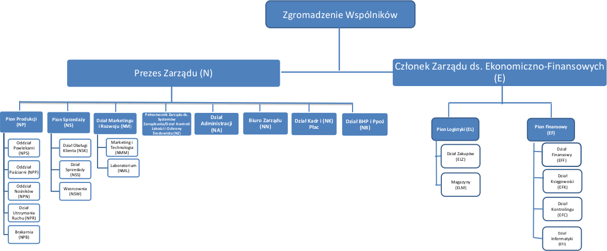

#1. Sformułowanie zadania projektowego

##1.1. Obszar i przedmiot modelowania

###1.1.1. Dziedzina problemu

Firma: Firma "Sanwil" S.A.

Miejsce: ul. Lwowska 52 Przemyśl

Dziedzina: Przemysł chemiczny

Cele firmy : Wytworzenie i sprzedaż materiałów powlekanych.

Zatrudnienie: Firma zatrudnia 110 pracowników podzielonych na piony.

Cel problemu: Utworzenie systemu zajmującego się zarządzaniem magazynem, zasobami ludzkmi oraz wspomaganiem produkcji.

##1.2. Obszar modelowania

###1.2.1. Opis struktury organizacyjnej

Za decyzję o kierunku rozwoju firmy odpowiada Zgromadzenie Wspólników, pod którym podlega prezes zarzdzajacy większością pionów z wyjątkiem pionu logistyki i pionu finansów. Pion logistyki, zajmujący się zamówieniami, i pion finansów zajmujący się księgowością są zarządzane przez Członka zarządu ds. Ekonomiczno-Finansowych podlegającego bezpośrednio pod Zgromadzenie Wspólników. Firma posiada kilka magazynów:

+ surowców
+ produktów
+ reklamacji

Firma wytwarza i sprzedaje sztuczne skóry dla przemysłu meblowego, obuwniczego i medycznego. Produkuje również materiały kaletnicze, odzieżowe, plandekowe oraz materiały na potrzeby wojska i przemysłu motoryzacyjnego. Projektowanie produktu jest oparte o indywidualne wymagania klienta. Surowce są zamawiane przez pracowników pionu logistyki i przekazane do magazynu surowców. Następnie w zależności od typu produktu, zostają one użyte przez jeden z oddziałów produkcji i przekazane do magazynu produktów. Następnie pion jakości sprawdza czy produkt zawiera jakieś wady i czy jest zgodny z normą ISO. Jeśli wszystkie wymagania zostały spełnione pracownicy pionu sprzedaży wysyłają towar do klienta. Odbywa się ona na terenie kraju jak i poza jego granicami , w szczególności na terenach Ukrainy i Rosji. Jeśli produkt zostanie zwrócony, trafia do magazynu reklamacji. Nie związany bezpośrednio z częścią kupna i sprzedaży jest pion Marketingu i Rozwoju, który zajmuje się badaniem technologii, zarządzaniem laboratorium oraz kontaktami z potencjalnymi klientami.W laboratorium kontroluje się jakość surowców, bada parametry wyrobów i wydaje atesty wewnętrzne .

###1.2.2. Obszary aktywności

a) Wspomaganie sprzedaży - Klient może złożyć zamówienie, tylko za pośrednictwem pracownika, telefonicznie lub osobiście. System pozwala pracownikom na zapisywanie i oglądanie danych o sprzedanych produktach oraz o klientach. Na podstawie wymagań zostaje utworzone zamówienia, po których sprzedaży utworzone będą faktury.

b) Wspomaganie produkcji - System zawiera informacje o produkcie, który jest w kolejce do produkcji, który jest obecnie w produkcji oraz który został wyprodukowany, a także o stanie maszyn produkcyjnych. Zapewnia odpowiedni przebieg procedur kontroli jakości zamówionych produktów.System monitoruje też stan surowców w magazynie upewniając się, że nie zostanie
ustalona produkcja jeśli nie ma ich wystarczająco.

c) Wspomaganie zakupu surowców - System zawiera informacje o ilości oraz składzie zakupionych materiałów, a także informacje o dostawcach. System umożliwia utworzenie zestawienia produktów, które należy zakupić oraz rejestruje dany zakup i jego przekazanie do magazyn surowcow.

d) Zarządzanie pracą - Prezes posiada możliwość zatrudniać, promować oraz zwalniać pracowników. Kierownicy mają możliwość zarządzania pracą swoich podwładnych. Reszta pracowników może sprawdzić w systemie swój harmonogram oraz odebrać zlecone im zadania. System pozwala na generowanie raportów i statystyki z dzialań pracowników, jak i ogolnego stanu firmy.

e) Wspomaganie pracy magazynów - Pracownicy są w stanie sprawdzić stan magazynu i na bieżąco go aktualizować podczas wydawania materiałów. Każdy z produktów jest okrelany poprzez swój unikalny kod. System dba o bezpieczny stan magazynów sygnalizujac ilosć danego materialu ponizej krytycznej linii.

##1.3 Opis obszarów aktywności

###1.3.1 Opis stanowisk pracy

* a) Prezes - odpowiada za zatrudnioną kadrę i sprawne funkcjonowanie firmy. Ma pełną decyzyjność w kwestii zatrudniania, promowania i zwalniania pracowników. Kontroluje przydział zadań w firmie i podejmuje strategicznie decyzje przy konsultacji ze zgromadzeniem wspólników.

* b) Członek Zarządu ds. Ekonomiczno-Finansowych - sprawuje pieczę nad strategicznymi pionami firmy - logistyką i finansami. Zastępuje w tych obowiązkach Prezesa Zarządu. Współpracuje z pionem logistyki podejmując decyzje odnośnie zakupu surowców i zarządzania stanem magazynu. Kontroluje także pion finansowy, kierując pracą w dziedzinie księgowości.

* c) Pracownik działu Obsługi Klienta - przyjmuje zamówienia i reklamacje telefoniczne oraz obsługuje klientów przychodzących osobiście. Zajmuje sie także  odpowiedzia na pyatnia od potencjalnych klientów.

* d) Pracownik Pionu Produkcji - ma dostęp do kolejki czekających do produkcji materiałów. Wytwarza materiały przeznaczone do sprzedaży. Może pobierać materialy przyslane z magazynu surowców.

* e) Pracownik działu Marketingu i Rozwoju - przeprowadza kontrole materiałów, dokonuje oceny sytuacji na rynku, ściśle współpracuje z laboratorium. Przeprowadza rozmowy z potencjalnymi klientami dlugoterminowymi.

* f) Magazynier - dba o dostępność zamawianych materiałów. Dokonuje odbioru dostaw, przygotowuje zamówienia do wysyłki.

###1.3.2 Opis procedur biznesowych

####1.3.2.1 Wspomaganie sprzedaży

* nawiązanie kontaktu z przedsiębiorstwem

* złożenie zamówienia

* sprawdzenie stanu zamówienia

* wpłata zaliczki

* odbiór zamówienia

* umówienie na rozmowę z przedstawicielem firmy

* zapłacenie za zamówienie

* przejrzenie złożonych zamówień

* przejrzenie historii zamówień danego klienta

####1.3.2.2 Wspomaganie produkcji

* przejrzenie materiałów oczekujących na produkcję

* aktualizacja procedur produkcyjnych

* odczytanie procedur produkcyjnych

* odebranie surowców do produkcji

* wyslanie wyprodukowanego materialu na magazyn

####1.3.2.3 Wspomaganie zakupu surowców

* wyświetl informacje o posiadanych surowcach

* złóż zamówienie na surowiec

* odbierz surowiec 

####1.3.2.4 Zarządzanie pracą

* zatrudnienie pracownika

* zwolnienie Pracownika

* promocja pracownika

* kontrola czasu pracy pracownika

* negocjowanie umowy z klientem

* tworzenie harmonogramu pracy

* zlecanie zadań pracownikowi

###1.3.2.5 Wspomaganie pracy magazynów

* zarządzanie materiałem wyprodukowanym w firmie
 
* sprawdzenie stanu magazynów

* odbierz material

* wyslij material 

##1.4 Zakres odpowiedzialności systemu

W zakres odpowiedzialności systemu wchodzą wymienione obszary aktywności. Będą one realizowane w pełnym zakresie. System nie pomoże w zrealizowaniu rekrutacji, a jedynie odnotuje wyniki takiego postępowania.

##1.5 Zwięzła nazwa problemu

Projekt systemu wspomagający prace firmy produkcyjno-handlowej działającej w obszarze materiałów skóropodobnych. Akronim: S.K.Ó.R.K.A 

##1.6 Cele do osiągnięcia

###1.6.1 Cele produktu

Celem do osiągnięcia przez produkt “SKÓRKA” jest wspomaganie produkcji oraz sprzedaży produktów skóropodobnych, w tym ułatwienie zapewnienia odpowiedniego poziomu jakości produktu oraz harmonogramu w zakładzie produkcyjnym, a także punktualną dostawę produktów od klienta oraz podniesienie zadowolenia pracowników poprzez wyeliminowanie problemów wynikających z braku organizacji czy nieprawidłowej komunikacji wewnątrz przedsiębiorstwa.

###1.6.2 Cele przedsięwzięcia projektowego

Naszym celem jest zaznajomienie się z poszczególnymi elementami projektowania systemów informatycznych z wykorzystaniem metodyki strukturalnej. Uzyskiwanie potrzebnych informacji od klientów podczas procesu projektowania oraz utrzymywanie dobrego kontaktu. Chcemy również nabrać doświadczenie w pracy grupowej, odpowiednim planowaniu działań oraz dotrzymywaniu terminów.
