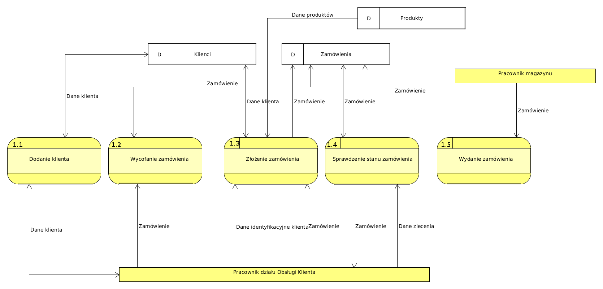
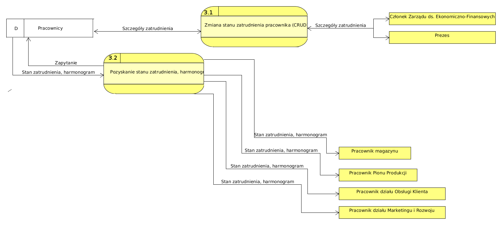

#1. Sformułowanie zadania projektowego

##1.1. Obszar i przedmiot modelowania

###1.1.1. Dziedzina problemu

Firma: Firma "Sanwil" S.A.

Miejsce: ul. Lwowska 52 Przemyśl

Dziedzina: Przemysł chemiczny

Cele firmy : Wytworzenie i sprzedaż materiałów powlekanych.

Zatrudnienie: Firma zatrudnia 110 pracowników podzielonych na piony.

Cel problemu: Utworzenie systemu zajmującego się zarządzaniem magazynem oraz zasobami ludzkimi oraz wspomaganie pracy.

##1.2. Obszar modelowania

###1.2.1. Opis struktury organizacyjnej

Za decyzję o kierunku rozwoju firmy odpowiada Zgromadzenie Wspólników, pod którym podlega prezes zarzdzajacy większością pionów z wyjątkiem pionu logistyki i pionu finansów. Pion logistyki, zajmujący się zamówieniami, i pion finansów zajmujący się księgowością są zarządzane przez Członka zarządu ds. Ekonomiczno-Finansowych podlegającego bezpośrednio pod Zgromadzenie Wspólników. Firma posiada kilka magazynów:

+ surowców
+ produktów
+ reklamacji

Firma wytwarza i sprzedaje sztuczne skóry dla przemysłu meblowego, obuwniczego i medycznego. Produkuje również materiały kaletnicze, odzieżowe, plandekowe oraz materiały na potrzeby wojska i przemysłu motoryzacyjnego. Projektowanie produktu jest oparte o indywidualne wymagania klienta. Surowce są zamawiane przez pracowników pionu logistyki i przekazane do magazynu surowców. Następnie w zależności od typu produktu, zostają one użyte przez jeden z oddziałów produkcji i przekazane do magazynu produktów. Następnie pion jakości sprawdza czy produkt zawiera jakieś wady i czy jest zgodny z normą ISO. Jeśli wszystkie wymagania zostały spełnione pracownicy pionu sprzedaży wysyłają towar do klienta. Odbywa się ona na terenie kraju jak i poza jego granicami , w szczególności na terenach Ukrainy i Rosji. Jeśli produkt zostanie zwrócony, trafia do magazynu reklamacji. Nie związany bezpośrednio z częścią kupna i sprzedaży jest pion Marketingu i Rozwoju, który zajmuje się badaniem technologii, zarządzaniem laboratorium oraz kontaktami z potencjalnymi klientami.W laboratorium kontroluje się jakość surowców, bada parametry wyrobów i wydaje atesty wewnętrzne .

###1.2.2. Obszary aktywności

a) Wspomaganie sprzedaży - Klient może złożyć zamówienie, tylko za pośrednictwem pracownika, telefonicznie lub osobiście. System pozwala pracownikom na zapisywanie i oglądanie danych o sprzedanych produktach oraz o klientach. Na podstawie wymagań zostaje utworzone zamówienia, po których sprzedaży utworzone będą faktury.

b) Wspomaganie produkcji - System zawiera informacje o produkcie, który jest w kolejce do produkcji, który jest obecnie w produkcji oraz który został wyprodukowany, a także o stanie maszyn produkcyjnych. Zapewnia odpowiedni przebieg procedur kontroli jakości zamówionych produktów.System monitoruje też stan surowców w magazynie upewniając się, że nie zostanie
ustalona produkcja jeśli nie ma ich wystarczająco.

c) Wspomaganie zakupu surowców - System zawiera informacje o ilości oraz składzie zakupionych materiałów, a także informacje o dostawcach. System umożliwia utworzenie zestawienia produktów, które należy zakupić oraz rejestruje dany zakup i jego przekazanie do magazyn surowcow.

d) Zarządzanie pracą - Prezes posiada możliwość zatrudniać, promować oraz zwalniać pracowników. Kierownicy mają możliwość zarządzania pracą swoich podwładnych. Reszta pracowników może sprawdzić w systemie swój harmonogram oraz odebrać zlecone im zadania. System pozwala na generowanie raportów i statystyki z dzialań pracowników, jak i ogolnego stanu firmy.

e) Wspomaganie pracy magazynów - Pracownicy są w stanie sprawdzić stan magazynu i na bieżąco go aktualizować podczas wydawania materiałów. Każdy z produktów jest okrelany poprzez swój unikalny kod. System dba o bezpieczny stan magazynów sygnalizujac ilosć danego materialu ponizej krytycznej linii.

##1.3 Opis obszarów aktywności

###1.3.1 Opis stanowisk pracy

* a) Prezes - odpowiada za zatrudnioną kadrę i sprawne funkcjonowanie firmy. Ma pełną decyzyjność w kwestii zatrudniania, promowania i zwalniania pracowników. Kontroluje przydział zadań w firmie i podejmuje strategicznie decyzje przy konsultacji ze zgromadzeniem wspólników.

* b) Członek Zarządu ds. Ekonomiczno-Finansowych - sprawuje pieczę nad strategicznymi pionami firmy - logistyką i finansami. Zastępuje w tych obowiązkach Prezesa Zarządu. Współpracuje z pionem logistyki podejmując decyzje odnośnie zakupu surowców i zarządzania stanem magazynu. Kontroluje także pion finansowy, kierując pracą w dziedzinie księgowości.

* c) Pracownik działu Obsługi Klienta - przyjmuje zamówienia i reklamacje telefoniczne oraz obsługuje klientów przychodzących osobiście. Zajmuje sie także  odpowiedzia na pyatnia od potencjalnych klientów.

* d) Pracownik Pionu Produkcji - ma dostęp do kolejki czekających do produkcji materiałów. Wytwarza materiały przeznaczone do sprzedaży. Może pobierać materialy przyslane z magazynu surowców.

* e) Pracownik działu Marketingu i Rozwoju - przeprowadza kontrole materiałów, dokonuje oceny sytuacji na rynku, ściśle współpracuje z laboratorium. Przeprowadza rozmowy z potencjalnymi klientami dlugoterminowymi.

* f) Magazynier - dba o dostępność zamawianych materiałów. Dokonuje odbioru dostaw, przygotowuje zamówienia do wysyłki.

###1.3.2 Opis procedur biznesowych

####1.3.2.1 Wspomaganie sprzedaży

* nawiązanie kontaktu z przedsiębiorstwem

* złożenie zamówienia

* sprawdzenie stanu zamówienia

* wpłata zaliczki

* odbiór zamówienia

* umówienie na rozmowę z przedstawicielem firmy

* zapłacenie za zamówienie

* przejrzenie złożonych zamówień

* przejrzenie historii zamówień danego klienta

####1.3.2.2 Wspomaganie produkcji

* przejrzenie materiałów oczekujących na produkcję

* aktualizacja procedur produkcyjnych

* odczytanie procedur produkcyjnych

* odebranie surowców do produkcji

* wyslanie wyprodukowanego materialu na magazyn

####1.3.2.3 Wspomaganie zakupu surowców

* wyświetl informacje o posiadanych surowcach

* złóż zamówienie na surowiec

* odbierz surowiec 

####1.3.2.4 Zarządzanie pracą

* zatrudnienie pracownika

* zwolnienie Pracownika

* promocja pracownika

* kontrola czasu pracy pracownika

* negocjowanie umowy z klientem

* tworzenie harmonogramu pracy

* zlecanie zadań pracownikowi

###1.3.2.5 Wspomaganie pracy magazynów

* zarządzanie materiałem wyprodukowanym w firmie
 
* sprawdzenie stanu magazynów

* odbierz material

* wyslij material 

##1.4 Zakres odpowiedzialności systemu

W zakres odpowiedzialności systemu wchodzą wymienione obszary aktywności. Będą one realizowane w pełnym zakresie. System nie pomoże w zrealizowaniu rekrutacji, a jedynie odnotuje wyniki takiego postępowania.

##1.5 Zwięzła nazwa problemu

Projekt systemu wspomagający prace firmy produkcyjno-handlowej działającej w obszarze materiałów skóropodobnych. Akronim: S.K.Ó.R.K.A 

##1.6 Cele do osiągnięcia

###1.6.1 Cele produktu

Celem do osiągnięcia przez produkt “SKÓRKA” jest wspomaganie produkcji oraz sprzedaży produktów skóropodobnych, w tym ułatwienie zapewnienia odpowiedniego poziomu jakości produktu oraz harmonogramu w zakładzie produkcyjnym, a także punktualną dostawę produktów od klienta oraz podniesienie zadowolenia pracowników poprzez wyeliminowanie problemów wynikających z braku organizacji czy nieprawidłowej komunikacji wewnątrz przedsiębiorstwa.

###1.6.2 Cele przedsięwzięcia projektowego

Naszym celem jest zaznajomienie się z poszczególnymi elementami projektowania systemów informatycznych z wykorzystaniem metodyki strukturalnej. Uzyskiwanie potrzebnych informacji od klientów podczas procesu projektowania oraz utrzymywanie dobrego kontaktu. Chcemy również nabrać doświadczenie w pracy grupowej, odpowiednim planowaniu działań oraz dotrzymywaniu terminów.

#2. Opis wymagań

###2.1.1 Funkcje z punktu widzenia prezesa i członków zarządu  

	a) Zmień stan zatrudnienia pracownika (CRUD)
	b) Wyznacz nagrodę służbową
	c) Wyznacz kierownika działu
	d) Pobierz statystyki odnośnie funkcjonowania przedsiębiorstwa

###2.1.2 Funkcje z punktu widzenia kierownika działu 

	a) Ustalanie harmonogramu pracy podwładnych
	b) Utworzenie raportu na temat funkcjonowania działu 

###2.1.3 Funkcje z punktu widzenia pracownika

	a) Sprawdzenie harmonogramu pracy
	b) Zatwierdzenie przyjęcia zadania
	c) Zatwierdzenie ukończenia zadania

###2.1.4 Funkcje z punktu widzenia pracownika Działu Produkcji

	a) Zgłoszenie awarii sprzętu 
	b) Odebranie materiałów koniecznych do produkcji
	c) Zapis wykonania produktu

###2.1.5 Funkcje z punktu widzenia pracownika Działu Obsługi Klienta

	a) Sprzedaż towaru 
	b) Dodanie notatki o kliencie 
	

###2.1.6 Funkcje z punktu widzenia pracownika magazynu

	a) Wydanie towaru 
	b) Odebranie materiałów
	c) Przeglądanie stanu magazynu

###2.1.7 Funkcje z punktu widzenia pracownika Działu Marketingu i Rozwoju

	a) Zawarcie umowy z firmą reklamową
	b) Wykonanie zadania wykonania materiałów reklamowych
	c) Zlecenie firmie zewnętrznej wykonania materiałów reklamowych
	d) Sprawdzenie nowo-powstałych materiałów
	e) Przeprowadzenie kontroli jakości
 
##2.2. Dane przechowywane w systemie

###2.2.1 Dane o pracownikach

	a) Imię i Nazwisko
	b) PESEL
	c) Data urodzenia
	d) Data zatrudnienia
	e) Data zwolnienia
	f) Stanowisko
	g) Harmonogram pracy
	h) Telefon
	i) Adres e-mail

###2.2.2 Dane o produktach

	a) Nazwa produktu
	b) Klasyfikacja
	c) Ilość
	d) Cena jednostkowa
	e) Miejsce przechowywania w magazynie
	f) Numer identyfikujący

###2.2.3 Dane o dostawcach

	a) Nazwa
	b) Osoba reprezentująca
	c) Adres
	d) Telefon
	e) Adres e-mail

###2.2.5 Dane o zamówieniach

	a) Klient
	b) Produkt
	c) Data złożenia
	d) Data dostarczenia
	d) Pozycje zamówienia
	e) Cena

###2.2.6 Dane o klientach

	a) Nazwa firmy
	b) NIP
	c) Adres
	d) Telefon
	e) Adres e-mail
	d) Osoba reprezentująca

##2.3. Dokumenty wprowadzane i wyprowadzane z systemu

###2.3.1 Dokumenty wprowadzane

	a) Faktury za materiały
	b) Faktury za sprzedaż
	c) Dane o klientach
	d) Dane o pracownikach

###2.3.2 Dokumenty wyprowadzane

	a) Faktury dla klientów
	b) Podsumowanie miesięczne/tygodniowe pracownika
	c) Plan dnia dla pracownika
	d) Dane o magazynie

##2.4. Wymagania specjalne i ograniczenia

### 2.4.1 Prostota obsługi

System ma być na tyle prosty i intuicyjny, żeby nie sprawiał trudności w obsłudze przez osobę, która wcześniej miała styczność z podobnym oprogramowaniem.

###2.4.2 Szybki dostęp

Niektóre partie systemu wymagają szybkiego dostępu.
Są to funkcje związane z zarządzaniem pracownikami a zwłaszcza <<CRUD>> harmonogramu pracy.

###2.4.3 Bezpieczeństwo danych

Najistotniejsze w systemie są dane o zamówieniach. Są kluczowym elementem działalności firmy, dlatego nie mogą być zagrożone. Istotne są także dane o klientach ze względu na ich poufny charakter.

###2.4.4 Dostępność systemu

System musi być dostępny niezbędnie w godzinach pracy. Poza nimi dopuszcza się niedługie przerwy serwisowe. Należy wymusić wykonywanie kopii bezpieczeństwa danych.

##2.5. Analiza wymagań funkcjonalnych

&nbsp; <!--- Zeby sie listy nie mergowaly-->

  **2.1.1 Tytuł: Sprzedaż towaru**

*   Aktor główny: Pracownik działu sprzedaży
*   Cel: Sprzedanie towaru
*   Gwarancja:  Stan systemu może ulec zmianie
*   Wyzwalacz: Klient dzwoni do firmy z zamiarem zamówienia materiału 

&nbsp; <!--- Zeby sie listy nie mergowaly-->

	
	1. Pracownik konsultuje z klientem rodzaj i cenę materiału
	2. Pracownik proponuje wstępną cenę i czas produkcji
	3. Pracownik wysyła zlecenie produkcji do zatwierdzenia
	4. Pracownik otrzymuje potwierdzenie produkcji i informuje klienta o aktualnym stanie
	5. Pracownik wysyła zlecenie wysyłki
	6. Po otrzymaniu płatności pracownik zatwierdza sprzedaż

&nbsp; <!--- Zeby sie listy nie mergowaly-->

  **2.2.1 Tytuł: Zgłoszenie awarii sprzętu**

*   Aktor główny: Pracownik działu produkcji
*   Aktorzy: Kierownik
*   Cel: Zgłoszenie awarii sprzętu w celu jak najszybszej naprawy
*   Poziom: Niebieski
*   Gwarancja:  Brak zmiany stanu systemu
*   Warunek początkowy: Nastąpiła awaria sprzętu
*   Wyzwalacz: Wejście na okno zgłoszenie problemu

&nbsp; <!--- Zeby sie listy nie mergowaly-->

	1. Pracownik zgłasza awarię sprzętu
	2. Zostaje poinformowany kierownik działu, który weryfikuje dana awarie
	3. Weryfikacja przebiegła pomyślnie i zostaje wysłana wiadomość do działu administracji 
		3.1.  Weryfikacja przebiegła niepomyślnie

&nbsp; <!--- Zeby sie listy nie mergowaly-->

  **2.2.2 Tytuł: Odebranie materiałów koniecznych do wykonania zadania**

*   Aktor główny: Pracownik działu produkcji
*   Cel: Odebranie materiałów
*   Poziom: Niebieski
*   Gwarancja: Brak zmiany stanu systemu
*   Warunek początkowy: Materiały potrzebne do produkcji zostały wysłane do magazynu
*   Wyzwalacz: Wejście na okno magazynu

&nbsp; <!--- Zeby sie listy nie mergowaly-->

	1. Pracownik sprawdza materiały
		1.1 Materiały są nieprawidłowe wiec zostają zwrócone
	2. Materiały zostają zapisane w systemie jako odebrane
	3. Materiały zostają zapisane w systemie jako użyte do produkcji

&nbsp; <!--- Zeby sie listy nie mergowaly-->

   **2.2.3 Tytuł: Zapisz ukończenia produkcji**

*   Aktor główny: Pracownik działu produkcji
*   Aktor: Pracownik działu marketingu i rozwoju
*   Cel: Zapisz do systemu ukończenia produkcji
*   Poziom: Niebieski
*   Gwarancja: Brak zmiany stanu systemu
*   Warunek początkowy: Materiał został wyprodukowany
*   Wyzwalacz: Wejście na okno produkcji

&nbsp; <!--- Zeby sie listy nie mergowaly-->

	1. Pracownik sprawdza czy produkt jest zgodny z wymaganiami
		1.1 Produkt nie jest zgodny , informacja zostaje wyslana do kierownika
	2. Sprawdzenie przez dzial rozwoju czy produkt jest zgodny z normami
		2.1 Produkt nie jest zgodny , informacja zostaje wyslana do kierownika
	3. Produkt zostaje zapisany jako ukonczony
	4. Produkt zostaje wyslany na magazyn

&nbsp; <!--- Zeby sie listy nie mergowaly-->

   **2.3.1 Tytuł: Zakup surowców**

*   Aktor główny: Pracownik działu sprzedaży 
*   Cel: Zakup surowców
*   Poziom: Niebieski
*   Gwarancja: Stan systemu jest bez zmian
*	Warunek początkowy: Otrzymano zadanie zakupu
*   Wyzwalacz: Wejście w okno zakupu

&nbsp; <!--- Zeby sie listy nie mergowaly-->
	
	1. Utworzono listę zakupów
	2. Złożono zamówienie surowców
	3. Zamówienie zostało przyjęte
		3.1. Brak surowca w hurtowni
	4. Zapłata i dołączenie faktury do systemu

&nbsp; <!--- Zeby sie listy nie mergowaly-->

  **2.4.1 Tytuł: Zmiana stanu zatrudnienia pracownika**

*   Aktor główny: Prezes
*   Aktorzy: Pracownik, kierownik pionu 
*   Cel: Zmiana w stanie zatrudnienia pracownika
*   Poziom: Niebieski
*   Gwarancja: Stan systemu nie zmienia się 
*   Warunek początkowy: Prezes otwiera okno zarządzania pracownikami
*   Wyzwalacz: Pracownik potrzebuje zmiany danych

&nbsp; <!--- Zeby sie listy nie mergowaly-->
 	
	1. Prezes wprowadza zmiany
	2. Pracownik dostaje informacje dotyczącą wprowadzonych zmian
	3. Kierownik pionu dostaje informacje o wprowadzonych zmianach
	4. Jeżeli było to zwolnienie to wypłacana jest odprawa

&nbsp; <!--- Zeby sie listy nie mergowaly-->

  **2.4.2 Tytuł: Wyznaczenie nagrody służbowej**

*   Aktor główny: Prezes	
*   Aktorzy: Pracownik	
*   Cel: Wyznaczenie nagrody służbowej
*   Poziom: Niebieski
*   Gwarancja: Brak zmian w systemie
*   Warunek początkowy: Prezes otwiera okno nagród
*   Wyzwalacz: Pracownik ma otrzymać nagrodę

&nbsp; <!--- Zeby sie listy nie mergowaly-->
 	
	1. Prezes przyznaje nagrodę
	2. Pracownik dostaje zawiadomienie o nagrodzie
	3. Dział księgowości dostaje informacje o zmianach

&nbsp; <!--- Zeby sie listy nie mergowaly-->

   **2.4.3 Tytuł: Wyznaczenie kierownika działu**

*   Aktor główny: Prezes
*   Aktorzy: Pracownik
*   Cel: Wyznaczenie kierownika z obecnych pracowników
*   Poziom: Niebieski
*   Gwarancja: Stan systemu jest bez zmian
*   Wyzwalacz: Wejście w okno wyznaczenia kierownika

&nbsp; <!--- Zeby sie listy nie mergowaly-->

	
	1. Prezes zapisuje zmiany w systemie
	2. Pracownik dostaje zawiadomienie o zmianach oraz dostęp do części systemu związanej ze stanowiskiem.
	3. Zawiadomienie reszty pracowników o zmianach
	4. Wysłanie informacji do administracji i księgowości 

&nbsp; <!--- Zeby sie listy nie mergowaly-->

   **2.4.4 Tytuł: Ustalenie harmonogramu pracy**

*   Aktor główny: Kierownik pionu
*   Aktorzy: pracownik
*   Cel: Ustawienie harmonogramu dla danego pionu
*   Poziom: Niebieski
*   Gwarancja: Brak zmiany stanu systemu
*   Wyzwalacz: Wejście kierownika pionu zmiany harmonogramu

&nbsp; <!--- Zeby sie listy nie mergowaly-->

	1. Wprowadzono zmiany do systemu
	2. Pracownik ma już ustaloną pracę w tym terminie
	3. Pracownik akceptuje wprowadzone zmiany 
	4. Pracownik nie zgadza się na pracę w tym terminie.

&nbsp; <!--- Zeby sie listy nie mergowaly-->

   **2.4.5 Tytuł: Odebranie zlecenia**

*   Aktor główny: Pracownik 
*   Cel: Przyjęcie zadania 
*   Poziom: Niebieski
*   Gwarancja: Brak zmiany stanu systemu 
*   Wyzwalacz: Pracownik wszedł na okno nieodebranego zadania

&nbsp; <!--- Zeby sie listy nie mergowaly-->

	1. Pracownik zatwierdził odebranie zadania
	2. Zostały wysłane wiadomości o koniecznych danych/materiałach do innych pracowników

&nbsp; <!--- Zeby sie listy nie mergowaly-->

   **2.4.6 Tytuł: Zaraportowanie wykonania zlecenia**
   
*   Aktor główny: Pracownik
*   Cel: Wysłanie raportu o wykonanym zadaniu
*   Poziom: Niebieski
*   Gwarancja:  Brak zmiany stanu systemu
*   Warunek początkowy: Pracownik posiada odebrane, ale nie wykonane zadanie 
*   Wyzwalacz: Pracownik wszedł na na okno danego zadania

&nbsp; <!--- Zeby sie listy nie mergowaly-->
	

	1. Pracownik zatwierdził wykonanie zadania
		1.1 Termin zakończenia zadania minął
	2. Informacje o zmianach w magazynie zostały dodane do systemu
	3. Informacje o zakończeniu zostały wysłane do kierownika działu.

&nbsp; <!--- Zeby sie listy nie mergowaly-->

&nbsp; <!--- Zeby sie listy nie mergowaly-->
	  
   **2.5.1 Tytuł: Wydanie towaru**

*   Aktor główny: Pracownik magazynu
*   Cel: Wysłanie towaru do klienta lub innego magazynu
*   Poziom: Niebieski
*   Gwarancja: Stan systemu nie zmienia się 
*	Warunek początkowy: Zadanie wysłania przesyłki zostało otrzymane
*   Wyzwalacz: Pracownik magazynu otwiera okno wydania towaru

&nbsp; <!--- Zeby sie listy nie mergowaly-->

    1. Pracownik magazynu wprowadza dane zadanie wysyłki do formularza    
    2. Dokonywana jest weryfikacja ze stanem magazynu    
        2.1 Odrzucono formularz
    3. Pracownik potwierdza wykonanie   
    4. Stan magazynu zmienia się. Wyświetla się stosowna informacja.

&nbsp; <!--- Zeby sie listy nie mergowaly-->

   **2.5.2 Tytuł: Odebranie materiałów**

*   Aktor główny: Pracownik magazynu
*   Cel: Zapis odebrania materiałów w systemie
*   Poziom: Niebieski
*   Gwarancja: Stan systemu nie zmienia się 
*   Wyzwalacz: Pracownik otrzymuje materiał

&nbsp; <!--- Zeby sie listy nie mergowaly-->

    1. Sprawdzenie czy paczka jest oczekiwana, zawiera poprawne materiały bądź jest w dobrym stanie
		1.1. Zawiadomienie kierownika bądź zwrot
	2. Przyjęcie paczki i odłożenie na magazyn
	3. Zapis do systemu
		

&nbsp; <!--- Zeby sie listy nie mergowaly-->

   **2.5.3 Tytuł: Sprawdzanie stanu magazynu**

*   Aktor główny: Pracownik magazynu
*   Cel: Uzyskanie niezbędnych informacji o stanie magazynu
*   Poziom: Niebieski
*   Gwarancja: Stan systemu nie zmienia się 
*   Wyzwalacz: Wejście w okno przeglądania magazynu

&nbsp; <!--- Zeby sie listy nie mergowaly-->

    1. Pracownik ustala określone filtry odnośnie przeglądania. Filtry dzielą się na kilka kategorii. 
    2. Generowany jest odpowiedni widok.  

&nbsp; <!--- Zeby sie listy nie mergowaly-->
 	
##2.6. Wymagania funkcjonalne dla dodatkowych funkcji systemu

*	Tytuł: Tworzenie kopii bezpieczeństwa
*	Aktor główny: Administrator
*	Aktorzy: Administrator
*	Cel: Stworzenie kopii bezpieczeństwa bazy
*	Poziom:
*   Wyzwalacz: Czasowy lub/i manualny
*	Gwarancja: Stan systemu nie zmienia się

&nbsp; <!--- Zeby sie listy nie mergowaly-->

    1. Administrator ustala sposób
	1.1 Administrator zleca wykonania kopi bezpieczeństwa w danej chwili
	1.2 Administrator planuje wykonanie kopii bezpieczeństwa
	1.3 Administrator planuje okresowo wykonanie kopii bezpieczeństwa

&nbsp; <!--- Zeby sie listy nie mergowaly-->

*	Tytuł: Wyświetlenie statystyk wydajności produkcji
*	Aktor główny: Prezes
*	Aktorzy: Kierownik pionu produkcji
*	Cel: Analiza efektywności działania pionu produkcyjnego
*	Poziom:
*	Gwarancja: Stan systemu nie zmienia się
*	Wyzwalacz: Wejście w okno statystyk produkcji

&nbsp; <!--- Zeby sie listy nie mergowaly-->

	1. Pracownik generuje dane statystyczne wybierając szczegółowe opcje
	2. Wyświetlają się wykresy wydajności z dostępnymi opcjami i dodatkowymi widokami

&nbsp; <!--- Zeby sie listy nie mergowaly-->

*	Tytuł: Wyświetlenie raportu działania systemu
*	Aktor główny: Prezes
*	Aktorzy: Prezes
*	Cel: Analiza działania systemu, sprawdzenie ostatnio występujących błędów
*	Poziom:
*	Gwarancja: Stan systemu nie zmienia się
*	Wyzwalacz: Wejście w okno raportu działania systemu

&nbsp; <!--- Zeby sie listy nie mergowaly-->

	1. Prezes wybiera interesujące opcje do wygenerowanego raportu
	2. Na prośbę użytkownika wyświetlają się błędy, które wystąpiły w ostatnim czasie w systemie
		2.1 Wyświetlana jest informacja o możliwych akcjach do podjęcia w celu naprawy błędu
		2.2 Użytkownik dokonuje wyboru spośród dostępnych opcji

&nbsp; <!--- Zeby sie listy nie mergowaly-->

##2.7. Wymagania niefunkcjonalne
###2.7.1 Funkcje produktowe
System powinien w zrozumiały sposób komunikować się z pracownikami poszczególnych pionów.
Interfejs, z którego korzystają pracownicy pionu produkcji musi być szybki, zrozumiały oraz
prosty w obsłudze. Po stronie pionów zarządzających wszelkie ustalania harmonogramu pracy
mają być widoczne od razu po wprowadzeniu w systemie.
###2.7.2 Funkcje organizacyjne
Podsystemy kontroli jakości i produkcji powinny opierać się na sprawdzonych technologiach
używanych w podobnych firmach. Każdy pracownik powinien zostać wyszkolony z obsługi funkcji systemowych
odpowiednio do stanowiska zajmowanego w firmie.
Należy zapewnić wsparcie techniczne. Wszelkie prace konserwacyjne w ramach systemu powinny odbywać się poza godzinami działania firmy.

#3. Analiza funkcjonalna systemu – diagramy DFD 

##3.1 Diagram kontekstowy systemu wraz z opisem

###3.1.1 Opis
Z systemem komunikować będzie się: prezes, członek zarządu, pracownik działu R&D, pracownik-sprzedawca, pracownik-magazynier, pracownik-produkcja.

* Prezes, członkowie zarządu: Mogą pobierać dane o funkcjonowaniu przedsiębiorstwa, mogą wprowadzać decyzje administracyjne, takie jak np. wydanie nowej linii produktu, zmiana zatrudnienia pracownika.
* Pracownik działu Marketingu i Rozwoju: Może pobierać dane o funkcjonowaniu przedsiębiorstwa, pobierać swój harmonogram pracy, oraz sprawdzić detale swojego zatrudnienia.
* Pracownik działu Obsługi Klienta: Może modyfikować dane o klientach, wykonywanych sprzedażach, dodawać zlecenia, pobierać swój harmonogram pracy, oraz sprawdzić detale swojego zatrudnienia.
* Pracownik magazynu: Może modyfikować stan magazynu, pobierać dane o nadchodzących dostawach, swój harmonogram pracy, oraz sprawdzić detale swojego zatrudnienia.
* Pracownik działu Produkcji: Może modyfikować wykonywanie zlecenia stan materiałów w magazynie, zgłaszać problemy, pobierać swój harmonogram pracy, oraz sprawdzić detale swojego zatrudnienia.

##3.2 Analiza top-down

###3.2.1 Wyszczególnienie

####3.2.1.1 Rysunek

####3.2.1.2 Opis
Powyższy diagram  DFD ukazuje wyodrębnienie pewnych podsystemów szerzej przedstawionych na kolejnych diagramach.

###3.2.2 Wspomaganie sprzedaży

####3.2.2.1 Rysunek

####3.2.2.2 Opis

	1.1 Pracownik wprowadza do systemu szczegółowe dane klienta, które następnie zostają zapisane w bazie danych.
	1.2 Pracownik wycofuje wskazane zamówienie. Musi ono zostać jednoznacznie sprecyzowane.
	1.3 Pracownik przyjmuje zamówienie od klienta. Dane klienta muszą być już wprowadzone do systemu. Wszystkie pozycje zamówienia muszą być wyszczególnione i zgodne z katalogiem produktów. Całość następnie zostaje wprowadzona do bazy.
	1.4 Pracownik, możliwie na życzenie klienta sprawdza stan zamówienia w systemie. Stan jest sprowadzany z bazy.
	1.5 Magazynier wydaje podane jednoznacznie zamówienie klientowi.

###3.2.3 Zarządzanie magazynem

####3.2.3.1 Rysunek

####3.2.3.2 Opis

	2.1 Pracownik produkcji wypisuje materiał z magazynu. Musi podać ilość oraz rodzaj. Pracownik magazynu musi zatwierdzić to zapotrzebowanie.
	2.2 Pracownik magazynu dodaje wyprodukowany produkt do magazynu. Musi explicite podać jaki to towar i ile go wyprodukowano.
	2.3 Pracownik magazynu wydaje produkt klientowi na bazie numeru zamówienia.
	2.4 Pracownik magazynu odbiera materiał od dostawcy. Dostawca musi być zarejestrowany w bazie.

###3.2.4 Zarządzanie pracą

####3.2.4.1 Rysunek

####3.2.4.2 Opis

	3.1 Prezes lub członek zarządu pragną zmienić stan zatrudniania pracownika. Ta funkcjonalność ma charakter CRUD. 
	3.2 Pracownik pragnie poznać swój aktualny stan zatrudnienia oraz harmonogram pracy.

###3.2.4 Zarządzanie produkcją

####3.2.4.1 Rysunek

####3.2.4.2 Opis

	4.1 Pracownik zgłasza problem w procesie produkcyjnym. Podaje numer urządzenia i opis usterki, a następnie otrzymuje potwierdzenie.
	4.2 Pracownik chce zmodyfikować<<CRUD>> stan zamówienia. Nowy stan musi być zgodny z wytycznymi nałożonymi przez zarząd firmy. Dokonywane jest sprawdzenie stanu materiałów na magazynie.
	4.3 Pracownik bądź 4.2 chce sprawdzić dostępność materiałów w magazynie. Podawany jest rodzaj materiału i ilość. W odpowiedzi uzyskuje się potwierdzenie lub zaprzeczenie danej kwerendy.

#4.Roboczy słownik danych

1. Magazyny danych

	1. Zgloszenia - udokumentowanie awarii maszyn
	2. Zamowienia - zlozone zamowienia przez klientow
	3. Produkty - spis materialow mozliwych do wyprodukowania
	4. Magazyn - ilosc i rodzaj materialow na magazynach
	5. Klienci - osoby, ktore uprzednio zakupily produkt, badz maja podpisana stala umowe z firma
	6. Dostawcy - firmy, z ktorymi podpisano umowy kurierskie
	
2. Obiekty
	1. Wspomaganie sprzedaży - dzial zajmujacy sie kontaktem z klientami
	2. Zarzadznie produkcja - dzial zajmujacy sie produkcja wlasciwa materialu skoropodobnego
	3. Zarzadzanie magazynem - obszar odbierajacy, przechowywujacy i wysylajacy materialy
	4. Zarzadznie praca - obszar zapewniajacy spojnosc harmonogramu oraz monitorujacy stan zatrudnienia pracownikow
	5. Wspomaganie zakupu surowcow - dzial zapewniajacy dostepnosc surowcow
	6. Administrowanie firmy - obszar zapewnianiajacy poprawne dzialanie systemu, kontrolujacy poprane dzialanie firmy
	7. Generowanie raportów i danych statystcznych - obszar zbierajacy dane i generujacy raporty oraz statystyki

#5. Analiza struktur danych przechowywanych w magazynach

##5.1 Diagram ERD

##5.2 Tabela krzyżowa

<table class="tg">
  <tr>
    <th class="tg-nrw8"> </th>
    <th class="tg-huh2">Pracownicy</th>
    <th class="tg-nrw8">Klienci</th>
    <th class="tg-nrw8">Osoby</th>
    <th class="tg-nrw8">Piony</th>
    <th class="tg-nrw8">Stanowiska</th>
    <th class="tg-nrw8">Harmonogramy</th>
    <th class="tg-nrw8">Produkty</th>
    <th class="tg-nrw8">Komponenty</th>
    <th class="tg-nrw8">Materiały</th>
    <th class="tg-nrw8">Zadania</th>
    <th class="tg-nrw8">Pozycje zamówienia</th>
    <th class="tg-nrw8">Dostawcy</th>
    <th class="tg-nrw8">Komponenty Produktów</th>
    <th class="tg-nrw8">Zamówienia</th>
  </tr>
  <tr>
    <td class="tg-nrw8">Pracownicy </td>
    <td class="tg-by3v">X </td>
    <td class="tg-by3v"> </td>
    <td class="tg-by3v"> </td>
    <td class="tg-by3v">X</td>
    <td class="tg-by3v"></td>
    <td class="tg-by3v">X</td>
    <td class="tg-by3v"></td>
    <td class="tg-by3v"></td>
    <td class="tg-by3v"></td>
    <td class="tg-by3v">X</td>
    <td class="tg-by3v"></td>
    <td class="tg-by3v"></td>
    <td class="tg-by3v"></td>
    <td class="tg-by3v">X</td>
  </tr>
  <tr>
    <td class="tg-nrw8">Klienci </td>
    <td class="tg-by3v"> </td>
    <td class="tg-by3v"> </td>
    <td class="tg-by3v"> </td>
    <td class="tg-by3v"></td>
    <td class="tg-by3v"></td>
    <td class="tg-by3v"></td>
    <td class="tg-by3v"></td>
    <td class="tg-by3v"></td>
    <td class="tg-by3v"></td>
    <td class="tg-by3v"></td>
    <td class="tg-by3v"></td>
    <td class="tg-by3v"></td>
    <td class="tg-by3v"></td>
    <td class="tg-by3v">X</td>
  </tr>
  <tr>
    <td class="tg-nrw8">Osoby </td>
    <td class="tg-by3v">X</td>
    <td class="tg-by3v">X</td>
    <td class="tg-by3v"> </td>
    <td class="tg-by3v"></td>
    <td class="tg-by3v"></td>
    <td class="tg-by3v"></td>
    <td class="tg-by3v"></td>
    <td class="tg-by3v"></td>
    <td class="tg-by3v"></td>
    <td class="tg-by3v"></td>
    <td class="tg-by3v"></td>
    <td class="tg-by3v">X</td>
    <td class="tg-by3v"></td>
    <td class="tg-by3v"></td>
  </tr>
  <tr>
    <td class="tg-nrw8">Piony</td>
    <td class="tg-by3v">X</td>
    <td class="tg-by3v"></td>
    <td class="tg-by3v"></td>
    <td class="tg-by3v"></td>
    <td class="tg-by3v"></td>
    <td class="tg-by3v"></td>
    <td class="tg-by3v"></td>
    <td class="tg-by3v"></td>
    <td class="tg-by3v"></td>
    <td class="tg-by3v"></td>
    <td class="tg-by3v"></td>
    <td class="tg-by3v"></td>
    <td class="tg-by3v"></td>
    <td class="tg-by3v"></td>
  </tr>
  <tr>
    <td class="tg-nrw8">Stanowiska</td>
    <td class="tg-by3v">X</td>
    <td class="tg-by3v"></td>
    <td class="tg-by3v"></td>
    <td class="tg-by3v"></td>
    <td class="tg-by3v"></td>
    <td class="tg-by3v"></td>
    <td class="tg-by3v"></td>
    <td class="tg-by3v"></td>
    <td class="tg-by3v"></td>
    <td class="tg-by3v"></td>
    <td class="tg-by3v"></td>
    <td class="tg-by3v"></td>
    <td class="tg-by3v"></td>
    <td class="tg-by3v"></td>
  </tr>
  <tr>
    <td class="tg-nrw8">Harmonogramy</td>
    <td class="tg-by3v"></td>
    <td class="tg-by3v"></td>
    <td class="tg-by3v"></td>
    <td class="tg-by3v"></td>
    <td class="tg-by3v"></td>
    <td class="tg-by3v"></td>
    <td class="tg-by3v"></td>
    <td class="tg-by3v"></td>
    <td class="tg-by3v"></td>
    <td class="tg-by3v"></td>
    <td class="tg-by3v"></td>
    <td class="tg-by3v"></td>
    <td class="tg-by3v"></td>
    <td class="tg-by3v"></td>
  </tr>
  <tr>
    <td class="tg-nrw8">Produkty</td>
    <td class="tg-by3v"></td>
    <td class="tg-by3v"></td>
    <td class="tg-by3v"></td>
    <td class="tg-by3v"></td>
    <td class="tg-by3v"></td>
    <td class="tg-by3v"></td>
    <td class="tg-by3v"></td>
    <td class="tg-by3v">X</td>
    <td class="tg-by3v"></td>
    <td class="tg-by3v">X</td>
    <td class="tg-by3v">X</td>
    <td class="tg-by3v"></td>
    <td class="tg-by3v"></td>
    <td class="tg-by3v"></td>
  </tr>
  <tr>
    <td class="tg-nrw8">Komponenty</td>
    <td class="tg-by3v"></td>
    <td class="tg-by3v"></td>
    <td class="tg-by3v"></td>
    <td class="tg-by3v"></td>
    <td class="tg-by3v"></td>
    <td class="tg-by3v"></td>
    <td class="tg-by3v"></td>
    <td class="tg-by3v"></td>
    <td class="tg-by3v"></td>
    <td class="tg-by3v"></td>
    <td class="tg-by3v"></td>
    <td class="tg-by3v"></td>
    <td class="tg-by3v"></td>
    <td class="tg-by3v"></td>
  </tr>
  <tr>
    <td class="tg-nrw8">Materiały</td>
    <td class="tg-by3v"></td>
    <td class="tg-by3v"></td>
    <td class="tg-by3v"></td>
    <td class="tg-by3v"></td>
    <td class="tg-by3v"></td>
    <td class="tg-by3v"></td>
    <td class="tg-by3v"></td>
    <td class="tg-by3v">X</td>
    <td class="tg-by3v"></td>
    <td class="tg-by3v"></td>
    <td class="tg-by3v"></td>
    <td class="tg-by3v"></td>
    <td class="tg-by3v"></td>
    <td class="tg-by3v"></td>
  </tr>
  <tr>
    <td class="tg-nrw8">Zadania</td>
    <td class="tg-by3v"></td>
    <td class="tg-by3v"></td>
    <td class="tg-by3v"></td>
    <td class="tg-by3v"></td>
    <td class="tg-by3v"></td>
    <td class="tg-by3v"></td>
    <td class="tg-by3v"></td>
    <td class="tg-by3v"></td>
    <td class="tg-by3v"></td>
    <td class="tg-by3v"></td>
    <td class="tg-by3v"></td>
    <td class="tg-by3v"></td>
    <td class="tg-by3v"></td>
    <td class="tg-by3v"></td>
  </tr>
  <tr>
    <td class="tg-nrw8">Pozycje zamówienia </td>
    <td class="tg-by3v"></td>
    <td class="tg-by3v"></td>
    <td class="tg-by3v"></td>
    <td class="tg-by3v"></td>
    <td class="tg-by3v"></td>
    <td class="tg-by3v"></td>
    <td class="tg-by3v"></td>
    <td class="tg-by3v"></td>
    <td class="tg-by3v"></td>
    <td class="tg-by3v"></td>
    <td class="tg-by3v"></td>
    <td class="tg-by3v"></td>
    <td class="tg-by3v"></td>
    <td class="tg-by3v"></td>
  </tr>
  <tr>
    <td class="tg-nrw8">Dostawcy</td>
    <td class="tg-by3v"></td>
    <td class="tg-by3v"></td>
    <td class="tg-by3v"></td>
    <td class="tg-by3v"></td>
    <td class="tg-by3v"></td>
    <td class="tg-by3v"></td>
    <td class="tg-by3v"></td>
    <td class="tg-by3v"></td>
    <td class="tg-by3v"></td>
    <td class="tg-by3v"></td>
    <td class="tg-by3v"></td>
    <td class="tg-by3v"></td>
    <td class="tg-by3v"></td>
    <td class="tg-by3v"></td>
  </tr>
  <tr>
    <td class="tg-nrw8">Komponenty Produktów </td>
    <td class="tg-by3v"></td>
    <td class="tg-by3v"></td>
    <td class="tg-by3v"></td>
    <td class="tg-by3v"></td>
    <td class="tg-by3v"></td>
    <td class="tg-by3v"></td>
    <td class="tg-by3v"></td>
    <td class="tg-by3v"></td>
    <td class="tg-by3v"></td>
    <td class="tg-by3v"></td>
    <td class="tg-by3v"></td>
    <td class="tg-by3v"></td>
    <td class="tg-by3v"></td>
    <td class="tg-by3v"></td>
  </tr>
  <tr>
    <td class="tg-nrw8">Zamówienia</td>
    <td class="tg-by3v"></td>
    <td class="tg-by3v"></td>
    <td class="tg-by3v"></td>
    <td class="tg-by3v"></td>
    <td class="tg-by3v"></td>
    <td class="tg-by3v"></td>
    <td class="tg-by3v"></td>
    <td class="tg-by3v"></td>
    <td class="tg-by3v"></td>
    <td class="tg-by3v"></td>
    <td class="tg-by3v">X</td>
    <td class="tg-by3v"></td>
    <td class="tg-by3v"></td>
    <td class="tg-by3v"></td>
  </tr>
</table>

## 5.3 Opis relacji miedzy obiektami

<table class="tg">
  <tr>
    <th class="tg-031e">Relacja</th>
    <th class="tg-031e">Tabele</th>
    <th class="tg-031e" colspan="2">Krotność</th>
  </tr>
  <tr>
    <td class="tg-031e">Jest przełożonym </td>
    <td class="tg-031e">Pracownicy - Pracownicy </td>
    <td class="tg-031e">1</td>
    <td class="tg-031e">0..N</td>
  </tr>
  <tr>
    <td class="tg-031e">Jest pracownikiem  </td>
    <td class="tg-031e">Osoby - Pracownicy </td>
    <td class="tg-031e">1</td>
    <td class="tg-031e">0..N</td>
  </tr>
  <tr>
    <td class="tg-031e">Zawiera</td>
    <td class="tg-031e">Stanowiska - Pracownicy </td>
    <td class="tg-031e">1</td>
    <td class="tg-031e">0..N</td>
  </tr>
  <tr>
    <td class="tg-031e">Zawiera</td>
    <td class="tg-031e">Piony - Pracownicy </td>
    <td class="tg-031e">1</td>
    <td class="tg-031e">0..N</td>
  </tr>
  <tr>
    <td class="tg-031e">Jest odpowiedzialny </td>
    <td class="tg-031e">Pracownicy - Pion </td>
    <td class="tg-031e">1</td>
    <td class="tg-031e">1..N</td>
  </tr>
  <tr>
    <td class="tg-031e">Obsługuje </td>
    <td class="tg-031e">Pracownicy - Zamówienia </td>
    <td class="tg-031e">1</td>
    <td class="tg-031e">0..N</td>
  </tr>
  <tr>
    <td class="tg-031e">Zleca</td>
    <td class="tg-031e">Pracownicy - Zadania </td>
    <td class="tg-031e">1</td>
    <td class="tg-031e">0..N</td>
  </tr>
  <tr>
    <td class="tg-031e">Jest odpowiedzialny </td>
    <td class="tg-031e">Pracownicy - Zadania </td>
    <td class="tg-031e">1</td>
    <td class="tg-031e">0..N</td>
  </tr>
  <tr>
    <td class="tg-031e">Ma przypisany </td>
    <td class="tg-031e">Pracownicy - Zadania </td>
    <td class="tg-031e">1</td>
    <td class="tg-031e">0..N</td>
  </tr>
  <tr>
    <td class="tg-031e">Występuje</td>
    <td class="tg-031e">Produkty - Zadania </td>
    <td class="tg-031e">1</td>
    <td class="tg-031e">1..N</td>
  </tr>
  <tr>
    <td class="tg-031e">Zawiera</td>
    <td class="tg-031e">Zamówienia - Pozycje zamówienia </td>
    <td class="tg-031e">1</td>
    <td class="tg-031e">1..N</td>
  </tr>
  <tr>
    <td class="tg-031e">Zlecił</td>
    <td class="tg-031e">Klienci - Zamówienia </td>
    <td class="tg-031e">1</td>
    <td class="tg-031e">0..N</td>
  </tr>
  <tr>
    <td class="tg-031e">Jest dostawcą </td>
    <td class="tg-031e">Dostawca - Osoby </td>
    <td class="tg-031e">1</td>
    <td class="tg-031e">0..1</td>
  </tr>
  <tr>
    <td class="tg-031e">Zawiera</td>
    <td class="tg-031e">Produkty - Materiał </td>
    <td class="tg-031e">1..N</td>
    <td class="tg-031e">1..N </td>
  </tr>
  <tr>
    <td class="tg-031e">Zawiera</td>
    <td class="tg-031e">Produkty - Pozycje zamówienia </td>
    <td class="tg-031e">1</td>
    <td class="tg-031e">1..N</td>
  </tr>
</table>

## 5.4 Opis struktur danych
<code>

Harmonogramy

	[id] [int] NOT NULL,
	[Pracownik] [int] NULL,
	[Dzien tygodnia] [varchar](10) NULL,
	[Godzina rozpoczecia] [time](7) NULL,
	[Godzina zakonczenia] [time](7) NULL,
	[Godzina rozpoczecia przerwy] [time](7) NULL,
	[Data p. obowiazywania] [date] NULL,
	[Data k. obowiazywania] [date] NULL

Klienci

	[id] [int] NOT NULL,
	[Nazwa firmy] [varchar](50) NULL,
	[Miasto] [varchar](50) NULL,
	[Ulica] [varchar](50) NULL,
	[Kod Pocztowy] [varchar](10) NULL,
	[Numer budynku] [smallint] NULL,
	[Numer miekszania] [smallint] NULL,
	[Adres e-mail] [varchar](50) NULL,
	[Osoba reprezentujaca] [int] NOT NULL,
	[Telefon] [varchar](50) NULL

Komponenty produktow

	[id] [int] NOT NULL,
	[Material] [int] NULL,
	[Produkt] [int] NULL

Materialy

	[id] [int] NOT NULL,
	[Nazwa] [varchar](40) NULL

Osoby

	[id] [int] NOT NULL,
	[Imie] [varchar](50) NULL,
	[Nazwisko] [varchar](50) NULL,
	[Miasto] [varchar](50) NULL,
	[Ulica] [varchar](50) NULL,
	[Kod pocztowy] [varchar](10) NULL,
	[Numer budnyku] [smallint] NULL,
	[Numer miekszania] [smallint] NULL,
	[Telefon] [varchar](50) NULL

Piony

	[id] [int] NOT NULL,
	[Nazwa] [varchar](50) NULL,
	[Szef] [int] NULL,

Pozycje zamowienia

	[id] [int] NOT NULL,
	[Produkt] [int] NULL,
	[Zamowienie] [int] NULL,
	[Ilosc] [int] NULL,
	[Rabat] [real] NOT NULL

Pracownicy

	[id] [int] NOT NULL,
	[Osoba] [int] NOT NULL,
	[Data urodzenia] [date] NULL,
	[Tytul] [varchar](50) NULL,
	[Stanowisko] [int] NOT NULL,
	[Pion] [int] NULL,
	[Data zatrudnienia] [date] NULL,
	[Data zwolnienia] [date] NULL,
	[Przelozony] [int] NULL,
	[Na zwolnieniu] [bit] NULL

Produkty

	[id] [int] NOT NULL,
	[Cena jednostkowa] [money] NULL,
	[Gramatura] [real] NULL,
	[Rodzaj] [varchar](40) NULL,
	[Opis slowny] [text] NULL,
	[Ilosc na magazynie] [int] NULL

Stanowiska

	[id] [int] NOT NULL,
	[Nazwa] [varchar](50) NULL

Zadania

	[id] [int] NOT NULL,
	[Zlecajacy] [int] NULL,
	[Produkt] [int] NULL,
	[Ilosc] [int] NULL,
	[Dealine] [date] NULL,
	[Data zlecenia] [date] NULL,
	[Data wykonania] [date] NULL,
	[Odpowiedzialny za wykonanie] [int] NULL,
	[Szczegoly] [text] NULL

Zamowienia

	[id] [int] NOT NULL,
	[Klient] [int] NULL,
	[Pracownik obslugujacy] [int] NULL,
	[Data zamowienia] [date] NULL,
	[Data wyslania] [date] NULL
<code/>

###Diagram aktywności

Pokazane poniżej diagramy aktywności są dokładnym opisem najważniejszych procedur w firmie

## Sprzedaż

Podczas sprzedaży zamówienie przechodzi przez 3 ( lub 4 jeśli nie ma wystarczająco surowców na magazynie ) obszary aktywności:

    1. Sprzedaż 
		1. Złożenie zamówienia przez klienta i zapewnienie zgody obustronnej co do warunków sprzedaży.
		2. Poinformowanie klienta o zakończeniu produkcji.
		3. Odebranie zapłaty i faktur.
    2. Produkcja
		1. Przygotowanie się do produkcji poprzez sprawdzenie gotowości maszyn i dostępu do produktu
		2. Produkcja
		3. Zadbanie o zgodność ze standardami
    3. Magazyn
		1. Dbanie o płynny przepływ materiałów między obszarami oraz firmą, a klientem
		2. Sprawdzanie czy jest wystarczająco surowców na magazynie
    4. Zakup
		1. Zamówienie surowców

## Zarządzanie magazynem

Akcja w diagramie aktywności w Zarządzaniu magazynem rozpoczyna się od przyjścia przesyłki.
Diagram nie precyzuje jaki jest to rodzaj przesyłki i od kogo, ponieważ przejście jest niezależne od tych danych.
Pozwala to zawrzeć w tym diagramie system dla wszystkich rodzajów magazynów oraz produktów.

1. Sprawdzenie poprawności przesyłki
2. Przyjęcie przesyłki
3. Zapisanie przesyłki do systemu i odłożenie na magazynem
4. Przesłanie dalej materiałów

## Zatrudnienie

Diagram Zatrudnienie porusza się w obszarze zarządzania pracą. 
Stan początkowy to decyzja o zatrudnieniu nowego pracownika.

1. Dodanie pracownika do systemu
2. Przypisanie pracownika do stanowiska
3. Przypisanie pracownikowi mentora
4. Zadbanie o poprawność pracownika w systemie 
5. Dodaj "benefit pack" pracownikowi

#9. Architektura systemu

## 9.1 Schemat architektury systemu

Poniżej zaprezentowany jest schemat architektury systemu.

## 9.2 Opis architektury systemu

Architektura systemu opiera się na schemacie klient - serwer. Wszystkie dane są umieszczone są w usłudze bazodanowej a program użytkownika komunikuje się z nią poprzez Internet. Serwer akceptuje połączenia tylko z wewnętrznej sieci firmy. Wyjątkiem jest konto Prezesa oraz Członków Zarządu, którzy mogą się komunikować z systemem bez korzystania z sieci wewnętrznej. Wszyscy inni pracownicy muszą korzystać z systemu tylko w zakładzie pracy albo korzystać z tunelowania. Powyższy zabieg jest kluczowy w celu utrzymania bezpieczeństwa systemu.

Nie przewidziany jest schemat pracy offline, ze względu na obecność wszystkich niezbędnych danych na serwerze.

#10. Projekt interfejsu użytkownika

## 10.1 Logowanie się do systemu

Po uruchomieniu aplikacji przez użytkownika generuje się okno logowania.

Użytkownik musi podać swój login i hasło, które następnie zostaje zweryfikowane.

Po wciśnięciu przycisku logowania uwidacznia się wiadomość o dacie ostatniego logowania.

## 10.2 Karty

Praca użytkownika w aplikacji oparta jest o karty, tak jak w przeglądarce internetowej. Ma to umożliwić korzystanie jednocześnie z wielu funkcji systemu, a jednocześnie przybliżyć wygląd do schematu wcześniej znajomemu użytkkownikowi.

Jeżeli używkonik posiadał wcześniej sesję w systemie to uwidacznia się poprzednia sesja.

Jeżeli nie to okno przybiera taką postać:

Użytkownik może wybrać jedną z opcji, co spowoduje zamianę bierzącej karty na kartę określonego typu. Wybór jest także możliwy przy pomocy klawiatury.

W każdym momencie użytkownik może otworzyć nową kartę klikając w "+" na pasku zakładek.

Użytkownik może też się wylogować przyciskając przyscisk "Wyloguj" w górnym prawym rogu ekranu.

## 10.3 Generalny układ okna na bazie obszaru magazynu

### 10.3.1 Wygląd

Oto przykładowy wygląd aplikacji bo wybraniu okna magazynu:

Użytkownik znajdując się w obszarze magazynu może wybierać z listy po lewej stronie konkretny widok czy funkcjonalność. Niektóre z nich mogą być kategoriami i zawierać własne podkategorie. Odpowiednia kategoria będzie widnieć w opisie danej karty.

Może też wybierać ogólne opcje takie jak: Plik, Edytuj, Widok, Narzędzia czy Pomoc. To menu jest widoczne w każdym widoku aplikacji.

### 10.3.2 Breakdown

Zobaczmy może troszkę bardziej czytelny obraz:

    1. Pasek narzędzi
    2. Przycisk wylogowania się
    3. Pasek kart
    4. Pasek kategorii
        4.1 Aktualna funkcjonalność
        4.2 Rozpiska kategorii
    5. Wybór filtrów
    6. Wybór tabel
    7. Pogląd
    8. Widok
    9. Pasek postępu oraz opis pracy systemu
    10. Dane o użytkowniku

## 10.4 Generalny układ okna na bazie obszaru sprzedaży

### 10.4.1 Wygląd

Oto przykładowa funkcjonalność znajdująca się w obszarze sprzedaży.

Pracownik może tutaj wybierać klienta oraz kompletować skład zamówienia. Po zatwierdzeniu może wprowadzić zamówienie do systemu oraz wydrukować jego skład.

### 10.4.2 Breakdown

Poniżej zaprezentowana rozpiska.

    1. Pasek narzędzi
    2. Przycisk wylogowania się
    3. Pasek kart
    4. Pasek kategorii
    5. Wybór klienta oraz szczegółów
    6. Edycja
    7. Pogląd, zaznaczony został nowy produkt - konstrukcja ułatwiająca dodawanie nowych pozycji
    8. Suma przed i po odliczeniu podatku
    9. Przyciski akcji
    10. Aktualny stan oraz postęp
    11. Dane sesji    

Dodawnie nowego produktu ułatwiono tutaj przez wiersz-widmo na tabeli. Podczas gdy podczas edycji aktualnej pozycji w oknie 6 można zobaczyć podgląd produktu, gdy zaznaczym wiersz-widmo, podgląd umożliwi wybranie rodzaju produktu i wpisanie szczegółów. Oczywiście edycja zamówienia poprzez edycje wiersza tabeli także jest możliwa. Naturalnie w pasku 3 także znajdują się opcję od dodawania oraz edycji pozycji zamówienia.

# 11. Podsumowanie

## 11.1 Założenia co do implementacji systemu

Klient będzie musiał wynająć hosting dla serwera danych oraz zapewnić dostęp do sieci, a także w pełni doposażyć firmę w niezbędny sprzęt komputerowy. Aplikacja będzie multiplatformowa, napisana w języku Java SE8, ze względu na jego łatwą przenośność oraz rozbudowane biblioteki graficzne a także bardzo dobrą obsługę różnych SZBD.

System zarządzania bazą danych będzie opierał się na PostgreSQL.

Na początku tworzenia aplikacji należy skupić się na poprawnym działaniu bazy danych, a także na szkielecie MVC aplikacji. Rozbudowa tego elementu systemu może okazać się niezbędna po rozwoju firmy a także zmiany wymagań już w trakcie procesu implementacji. Na tym etapie należy używać mock-up'ów a po jego skończeniu należy przeprowadzić test integracyjny. Po przejściu przez ten fragment projektu należy zaimplementować poszczególne modułowe funkcjonalności. Taka kolejność zapewni łatwą obsługę błędów.

## 11.2 Weryfikacja projektu systemu

Na etapie weryfikacji spójności projektu nie wykryto żadnych błędów i nie
stwierdzono nieścisłości. Projekt zdaje się spełniać wszystkie postawione przed
systemem wymagania użytkowników. Również ze strony klienta nie mieliśmy żadnych
sygnałów dotyczących ewentualnych poprawek. Dlatego też uznajemy powstały projekt
systemu za poprawny.

## 11.3 Uwagi i wnioski końcowe

Stworzenie projektu systemu informatycznego okazało relatywnie łatwym zadaniem. Największą trudnością okazało się utrzymanie spójności projektu oraz skupienia się na najważniejszych częściach systemu, co spowodowało problem z dziedziny perfekcjonistyczno-praktycznej. Od strony dydaktycznej projekt pozwolił nam na zapoznanie się z problemami jakie możemy napotkać w przyszłości,
rozpoczynając od kłopotów ze skontaktowaniem się z klientem przez problemy z
organizacją pracy na trudnościach z utrzymaniem spójności projektu. Uznajemy, że stworzony przez nas produkt spełnia wszystkie wymagania. Uzyskane doświadczenie ułatwi wykonywanie tego przedśięwzięć w przyszłości.

#13. Wykorzystane narzędzia

    - UMLet
    - Retext
    - Evolus Pencil
    - TexMaker
    - MarkPad
    - Git
    - GNU Image Manipulation Program
    - Gedit
    - Microsoft SQL Studio 2012
    - Visual Paradigm

#14. Słownik pojeć biznesowych

	1. Prezes  - Osoba odpowiadająca za zatrudnianie oraz zwalnianie pracowników oraz zarządza całością działa w firmie. Bezpośrednio pod nią podelgają kierownicy działów.
	2. Zarząd – osoby dyktujące kierunek w którym zmierza firma nie ingerujące w dużym stopniu w jej wewnętrzną 		strukturę.
	3. Kierownik działu – pracownik na stanowisku kierowniczym ma za zadanie zarządzać grupą pracowników mu 		popdporządkowanych oraz pilnować 
	4. Dział Obsługi Klienta – dział zajmujący się sprzedażą produktu. Odpowiedzialny jest za utworzenie i przekazanie 	dalej dokładnego zlecenia klienta.
	5. Dział Marketingu i Rozwoju – dział zajmujący się różnego rodzaju umowani w jak i poza granicami kraju, a także 	zawiera w sobie część laoraturyjną gdzie badane są nowe produkty.
	6. Materiał – Przedmiot będący surowcem, półproduktem bądź produktem końcowym.
	7. Surowce – materiały potrzebne do produkcji sztucznych skór.
	8. Sprzęt  - maszyny służące do produkcji materiałów powlekanych w tym. 
	9.  Magazyn – firma posiada trzy rodzaje magazynów : magazyn surowców, produktów i reklamacji. W zależności od typu  są przechowywane w nich materiały.
	10. Pracownik magazynu – pracownik stacjonujący na magazynie. Odpowiada, za poprawane dostarczenie/odebranie  		materiałów dla kuriera jak i do działu produkcji.
	11. Niewykonane zlecenie – zadanie, które zostało odebrane, ale nie zostało zatwierdzone jego wykonanie.
	12. Nieodebrane zlecenie – zadanie, które zostało wysłane do pracownika, ale nie zostało przez niego odebrane.

# Spis rysunków
	
	1. Sformułowanie zadania projektowego
		schemat
	2. Opis wymagań
		Magazyn_razem
		Odebranie_zlecenia_wykonania_produktu
		podsystemy
		Praca_razem
		Produkcja_razem
		Sprawdzenie_stanu_magazynu
		Sprzedaz_towaru
		Ustalenie_harmonogramu_pracy
		Wpisanie_wyprodukowanego_towaru
		Wydanie_towaru_kurierowi
		Wyznaczenie_kierownika_dzialu
		Wyznaczenie_nagrody_sluzbowej
		Zareportowanie_wykonania_zlecenia
		Zgloszenie_awarii_sprzetu
		Zmiana_stanu_zatrudnienia_pracownika
	3. Analiza funkcjonalna systemu – diagramy DFD 
		DFD0
		obslugaMagazynu
		obslugaProdukcji
		obslugaSprzedazy
		obslugaZatrudnienia
		systemDFD
	5. Analiza struktur danych przechowywanych w magazynach
		diagram
		diagram_rolled
	6. Diagramy aktywności
		Magazyn
		Praca
		Sprzedaz
	9. Architektura systemu
		schemat.odg
		schemat
		spis.txt
	10. Projekt interfejsu użytkownika
		logofirmy
		dostawcy_symbol
		logowanie
		magazyn_breakdown
		magazyn
		magazyn_symbol
		material_podglad
		nowa_karta2
		nowa_karta
		praca_symbol
		produkcja_symbol
		sprzedaz-breakdown
		sprzedaz
		sprzedaz_symbol
		stat_symbol
		zarzadzanie_symbol

